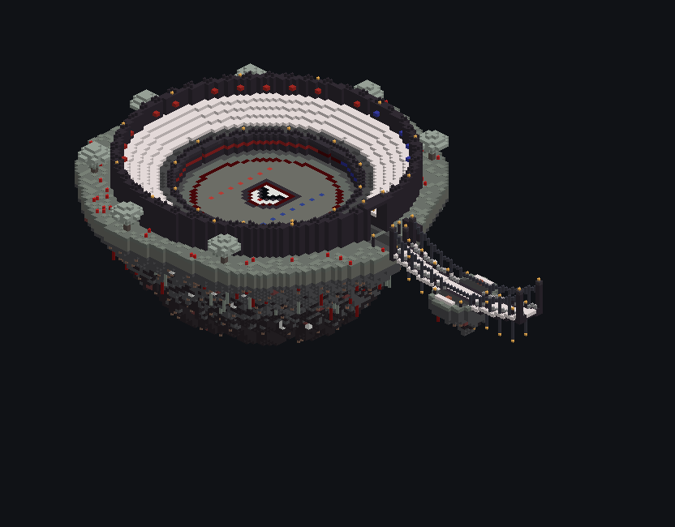
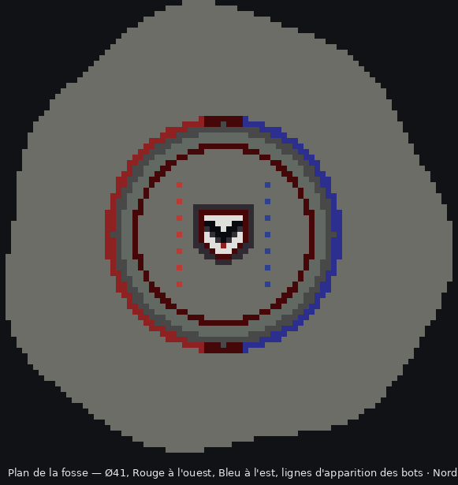
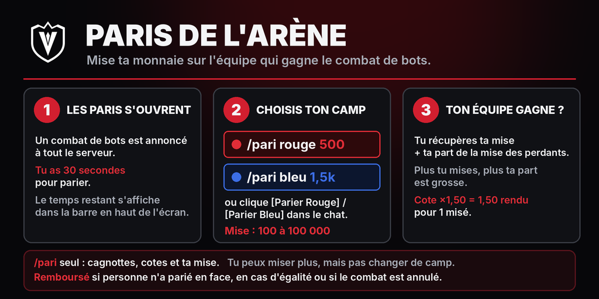

# Arène de bots du spawn



Une île flottante dans l'identité visuelle du spawn, avec une fosse de combat pour le plugin [VæloriaArena](../../docs/ARENA_BOTS.md). Les bots s'y battent en P4 U3, hache Sharpness V en main, pendant que les joueurs regardent depuis les gradins et parient leur monnaie sur l'équipe gagnante.

## Contenu

- **Fosse de combat** de 41 blocs de diamètre, 5 blocs sous le niveau des spectateurs. Les bots ne peuvent pas en sortir.
  - Sol en tuff, avec un anneau de red nether bricks et le blason en V du spawn au centre.
  - **Côté ouest aux couleurs de Rouge, côté est aux couleurs de Bleu** : bandeau sur le mur, bannières, losanges sur les lignes d'apparition des bots (à 8 blocs du centre, comme dans le plugin).
  - Éclairage invisible (blocs `light`) : pas de mobs naturels, et le combat reste lisible la nuit.
- **Promenade** au niveau du spawn tout autour de la fosse, derrière un muret continu.
- **4 rangs de gradins** en pale oak, avec un mur du fond crénelé, des lanternes et des bannières rouges et bleues.
- **Entrée à l'est**, sous un porche en verre rouge et bleu. Sur le côté, un **panneau des paris** explique `/pari rouge|bleu <mise>`.
- **Ponton suspendu** de 40 blocs vers le spawn, sur le modèle des ponts du spawn. Le tablier s'incurve vers le bas, entre des pylônes et des câbles en chaînes, avec un îlot de repos au point le plus bas.



## Fichiers

| Fichier | Contenu | Point de collage |
|---|---|---|
| `arene-spawn-complete.schem` | Île + ponton (122 × 56 × 83) | plancher du bout libre du ponton |
| `arene-spawn-seule.schem` | Île seule (83 × 56 × 83) | plancher au bord est de l'île, là où arrive le ponton |
| `arene.json` | Centre de la fosse et rayon pour le plugin, relatifs aux deux points de collage | — |
| `generate.py` | Générateur (Python 3, Pillow pour les aperçus). Il réutilise les outils de `../ile-commerciale/generate.py`. | — |

Format Sponge v2 (WorldEdit 7 / FastAsyncWorldEdit), Minecraft 1.21.4, comme le gabarit du spawn.

## Collage en jeu

L'arène se place **à l'ouest du spawn**, en face de l'Île Marchande qui est à l'est : le ponton part de l'arène vers l'est.

1. Copier les `.schem` dans `plugins/WorldEdit/schematics/` (ou `plugins/FastAsyncWorldEdit/schematics/`).
2. Se placer **sur le sol du spawn, juste après le dernier bloc de son bord ouest**, dans l'axe d'un chemin, sans changer de hauteur. Le gabarit du spawn n'est pas dans ce dépôt : si son bord ouest est symétrique de son bord est (+85 pour l'Île Marchande), c'est `/tp <X-86> <Y> <Z>` depuis le point où le spawn a été collé.
3. Lancer `//schem load arene-spawn-complete`, puis **`//paste -a`**. Le `-a` évite que l'air du schematic efface ce qui se trouve autour.
4. Pour placer l'arène d'un autre côté du spawn, faire `//rotate` avant de coller : `//rotate 90` met le ponton vers le sud (arène au nord), `//rotate 180` vers l'ouest et `//rotate 270` vers le nord (arène au sud).

## Brancher le plugin

1. Depuis le point de collage, aller au centre de la fosse : **`/tp ~-81 ~-4 ~`** (sans rotation ; sinon descendre dans la fosse et se placer sur le blason).
2. Lancer **`/botarena setcentre 18`**.
3. Tester avec `/botarena start 2`. Pour des combats automatiques avec paris, mettre `auto.enabled: true` dans `plugins/VaeloriaArena/config.yml`, puis `/botarena reload`.

Un `/setwarp arene` sur la promenade, devant l'entrée, permet aux joueurs de venir parier et regarder.

## Regénérer

```sh
python3 generate.py              # ponton de 40 blocs
python3 generate.py --ponton 60  # autre distance avec le spawn ; arene.json donne les nouveaux décalages
```

## Affiche « Comment parier »



C'est une affiche paysage à poser devant l'entrée de l'arène. Elle explique en 3 étapes l'ouverture des paris, les commandes `/pari rouge|bleu <mise>` et le calcul des gains, avec les règles de remboursement.

| Fichier | Taille | Usage |
|---|---|---|
| `affiche-paris-8x4.png` | 1024 × 512 | mur de 8 × 4 cartes (recommandé) |
| `affiche-paris-6x3.png` | 768 × 384 | mur de 6 × 3 cartes |
| `affiche-paris.png` | 2048 × 1024 | impression, écran, Discord |

En jeu, le plus simple est de passer par un plugin d'images sur cartes. Avec ImageOnMap, on met l'image en ligne puis on lance `/tomap <url> resize 8 4`. Ensuite, il faut poser les cartes dans un mur de cadres de 8 × 4. Les cadres invisibles (`glow_item_frame` ou `item_frame` avec `Invisible:1b`) donnent un rendu plus propre.

Les textes reprennent les réglages par défaut de `config.yml` : 30 s de paris et une mise de 100 à 100 000. Si tu changes ces valeurs, regénère l'affiche avec `python3 affiche-paris.py --duree 45 --min 50 --max 50000`.
