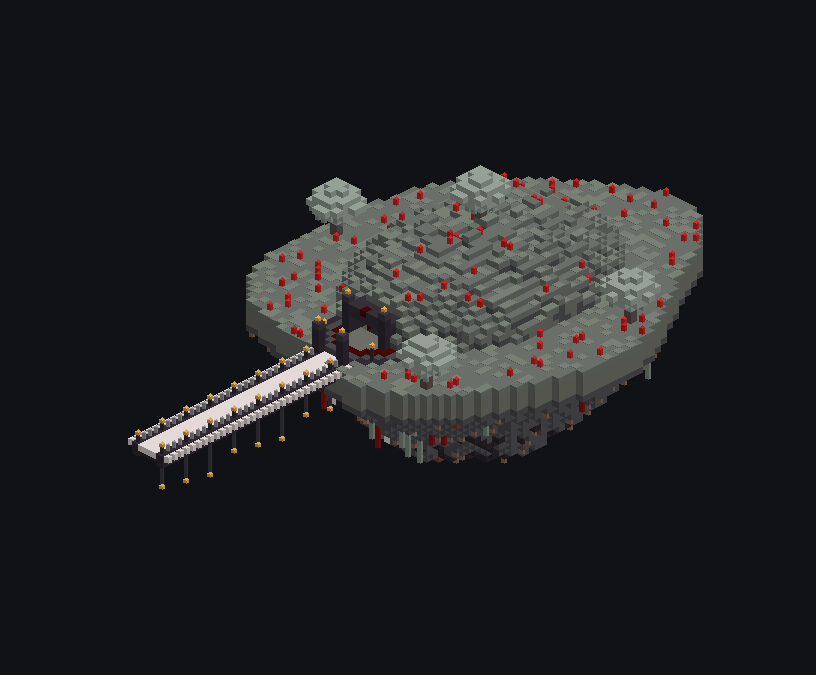
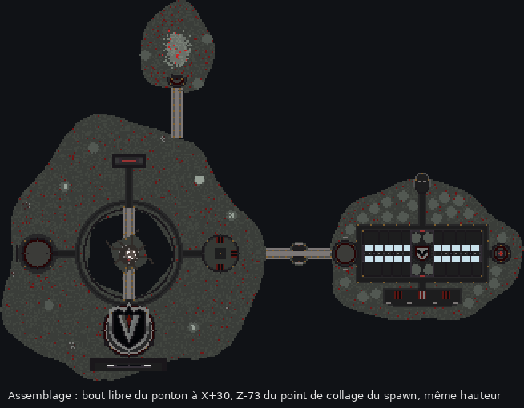
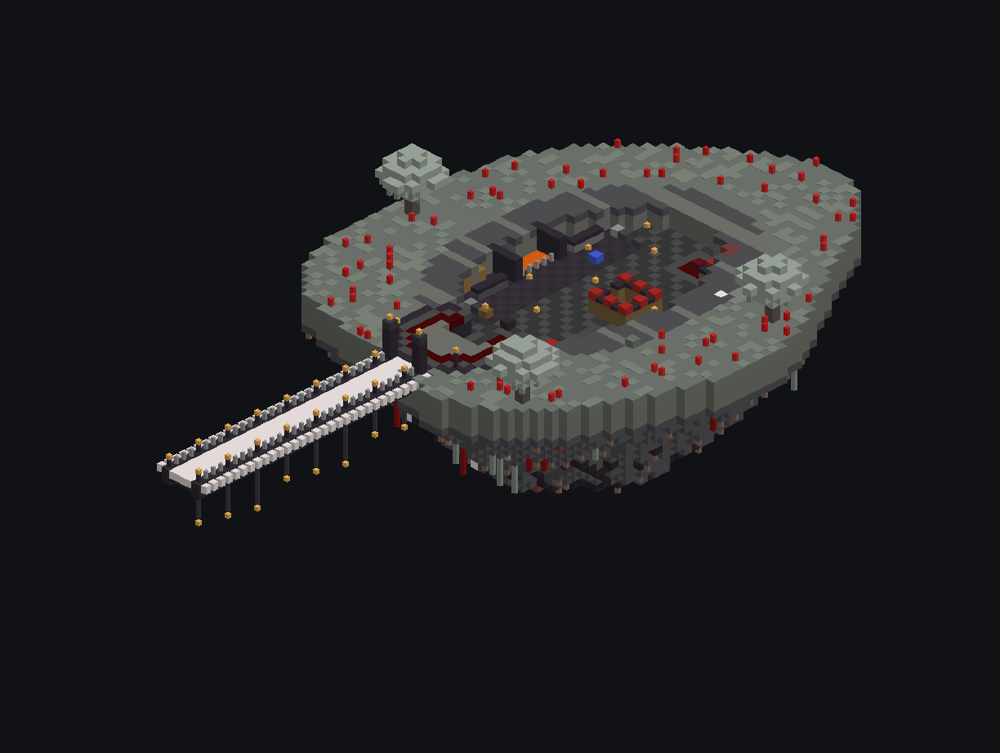
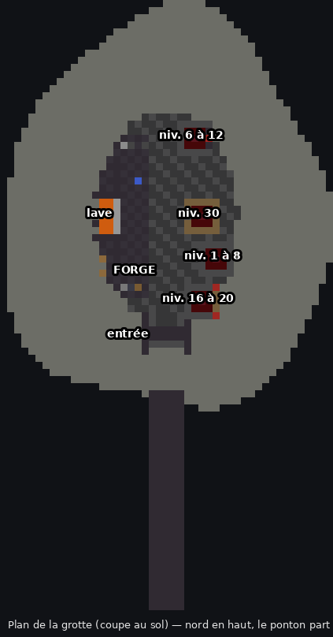

# Grotte de la Forge — forge et enchantement

Une petite île flottante creusée d'une grotte, reliée au spawn par un ponton. Elle a la même identité visuelle que le spawn et que l'Île Marchande. Le fichier est `grotte-forge.schem` (47 × 42 × 86, Minecraft 1.21.4).

## Rattachement au spawn

La grotte est **au nord du spawn**, dans le coin nord-est. Cet endroit est libre : il n'y a ni le portail rouge, ni l'arène, ni le blason, et il reste loin de l'Île Marchande. Le ponton descend vers le sud et son bout libre touche le bord nord du spawn.

| Repère | X | Y | Z |
|---|---|---|---|
| Point où le spawn a été collé | X | Y | Z |
| **Point de collage de la grotte** | **X + 30** | **Y** | **Z − 73** |
| Ou, depuis la lodestone du spawn (Lx, Ly, Lz) | **Lx + 30** | **Ly** | **Lz − 135** |

Pour coller la grotte :
1. Téléporte-toi pile sur ces coordonnées avec `/tp`, en vol.
2. Tape `//schem load grotte-forge`.
3. Tape **`//paste -a`**.

## Intérieur

On entre par un portail à piliers, puis un escalier de 3 marches descend dans la grotte (30 × 20 blocs, jusqu'à 9 de haut).

**Forge** (moitié nord) :
- un bassin de lave derrière des barreaux, sous une hotte en blackstone ;
- 4 hauts fourneaux et 4 fourneaux ;
- une table de forgeron, un établi et un tailleur de pierre ;
- 2 enclumes, une meule et un chaudron d'eau ;
- des tonneaux de rangement.

**Enchantement** (moitié sud) : 4 tables pour choisir son niveau, chacune avec un panneau.

| Table | Bibliothèques | Emplacement du haut |
|---|---|---|
| Niveau 30 | 15 et plus (anneau complet sur 2 hauteurs) | toujours 30 |
| Niveaux 16 à 20 | 8 | 16 à 20 |
| Niveaux 6 à 12 | 3 | 6 à 12 |
| Niveaux 1 à 8 | 0 | 1 à 8 |

Les emplacements du milieu et du bas de chaque table donnent aussi des niveaux plus faibles. Le générateur recompte les bibliothèques comme le jeu (la case entre la table et la bibliothèque doit être vide), donc les niveaux du tableau sont vérifiés. Une enclume à côté sert à combiner les livres.

La grotte est entièrement éclairée par des lanternes, des bougies rouges et la lave. Le générateur vérifie qu'aucune case de sol n'est à la lumière 0, donc les monstres ne peuvent pas y apparaître.

## Regénérer

Lancer `python3 generate.py [--ponton 30] [--spawn vaeloria-spawn-gabarit.schem]`. Le script reprend les briques de `../ile-commerciale/generate.py` : rocher, ponton, export et aperçus.
