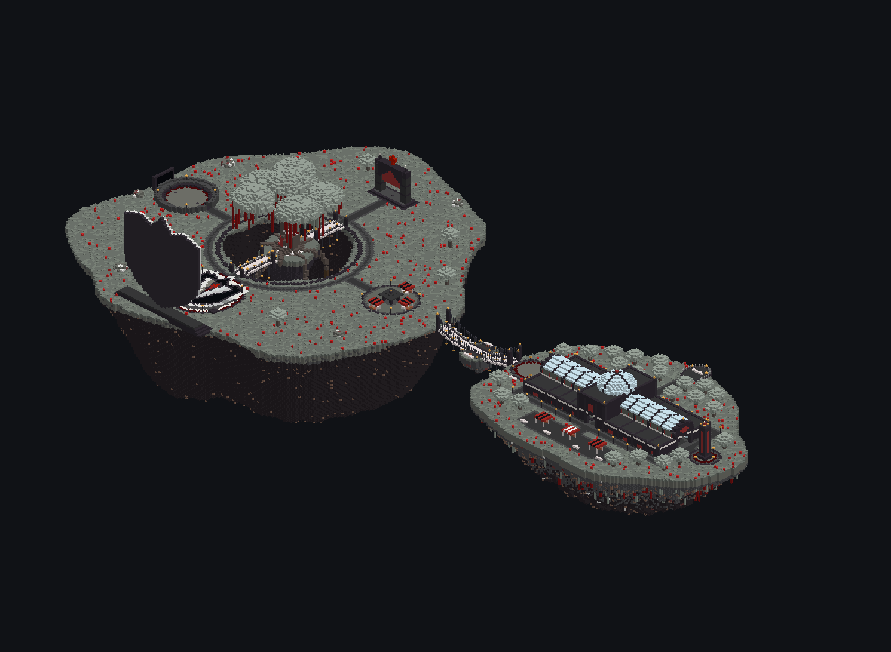
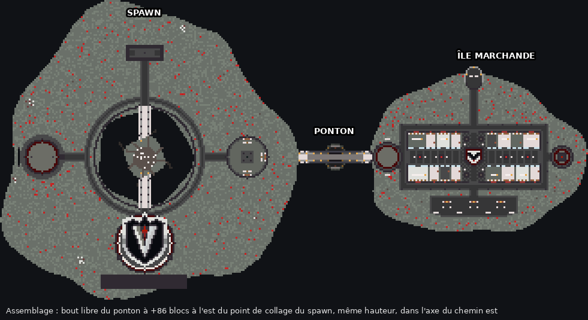
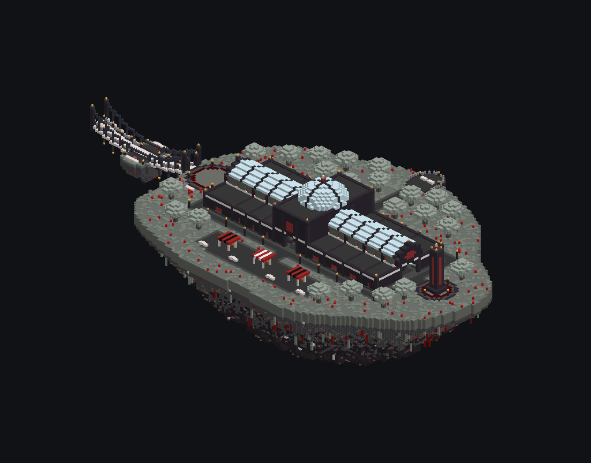
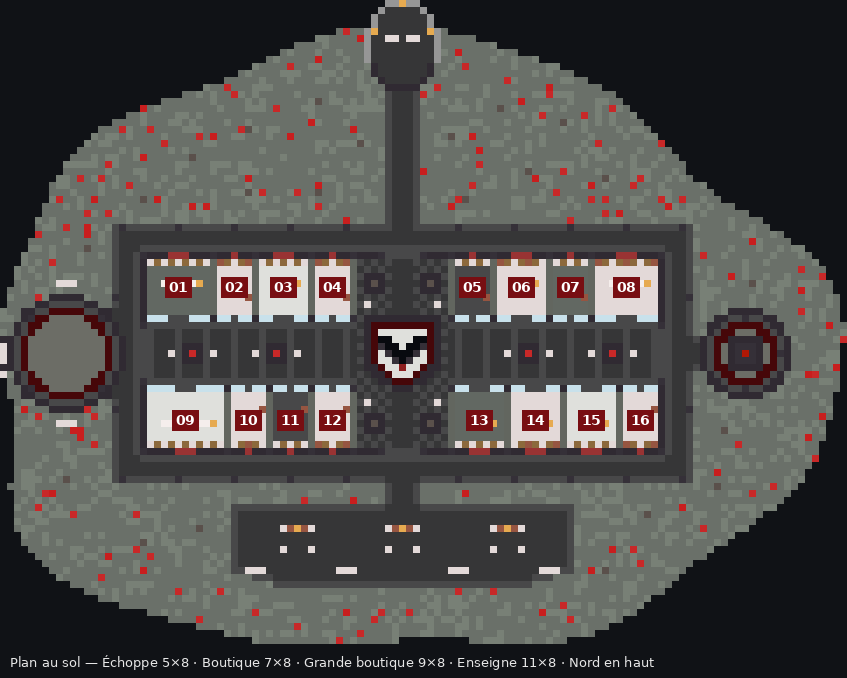

# Île Marchande — île flottante commerciale + ponton

Une île flottante commerciale de 16 boutiques, avec un ponton. Elle reprend l'identité visuelle du gabarit du spawn (`vaeloria-spawn-gabarit.schem`). Le spawn n'est pas inclus : il n'y a que l'île et le ponton, dont le bout libre est à raccorder au spawn.

## Rattachement au spawn

L'île se rattache **au côté est du spawn, dans l'axe du chemin est**, celui qui mène au marché du spawn (les 4 étals à stores rouge et noir, avec les tonneaux et l'ender chest). C'est là que l'île commerciale prolonge le plus naturellement le spawn.

- Le ponton a la même largeur que le chemin est du spawn : 5 blocs, briques et 3 planches, comme le chemin en polished deepslate et deepslate tiles.
- Son plancher est au même niveau que le sol du spawn (le pale moss).
- Le bout libre arrive à **+86 blocs à l'est du point de collage du spawn**, contre le dernier bloc du bord est. Entre le marché du spawn et le bord, il reste environ 16 blocs de mousse où prolonger le chemin.

## Identité visuelle reprise du spawn

| Élément | Sur le spawn | Sur l'Île Marchande |
|---|---|---|
| Sol | pale moss, tapis de mousse, tulipes et coquelicots rouges | identique |
| Rocher | cône de cobbled deepslate qui vire au blackstone, filons de redstone, calcite, stalactites | même profil de cône, mêmes blocs, lianes et mousse pâle pendantes |
| Chemins | cœur en deepslate tiles, bordure en polished deepslate | identique, hall compris |
| Ponts | briques de blackstone polie, planches et trappes en pale oak, barreaux, poteaux avec lanterne, lanternes suspendues | ponton construit sur le même modèle, avec les mêmes piliers d'entrée |
| Plateformes rondes | tuff, anneau de red nether bricks, polished deepslate, briques | plateforme d'arrivée et socle de l'obélisque |
| Marché | piquets en pale oak, stores rouge et noir, tonneaux, jarres | stores des boutiques et 3 étals sur la place sud |
| Blason | grand V noir sur calcite, cerclé de rouge | V en réduction au sol de la rotonde |
| Rouge | portail en verre rouge, blocs de redstone | vitraux rouges, obélisque rouge à cœur lumineux |
| Arbres | petits pale oaks avec mousse pâle pendante | une trentaine, plus 4 dans la rotonde |

## Contenu

- **Hall commercial** (75 × 29 blocs) : une galerie couverte d'une verrière à fermes noires, et une rotonde centrale à coupole avec le blason en V au sol.
- **16 boutiques** de 4 tailles différentes :

  | Type | Intérieur (L × P × H) | Nombre | Boutiques |
  |---|---|---|---|
  | Échoppe | 5 × 8 × 5 | 8 | 02, 04, 05, 07, 10, 11, 12, 16 |
  | Boutique | 7 × 8 × 5 | 5 | 03, 06, 13, 14, 15 |
  | Grande boutique | 9 × 8 × 5 | 2 | 01, 08 |
  | Enseigne | 11 × 8 × 5 | 1 | 09 |

  Chaque boutique a une vitrine, un store rayé, un panneau numéroté « À louer » (ciré), des étagères (tonneaux et jarres), un comptoir à partir de la taille Boutique, et des lanternes.
- Une **plateforme d'arrivée** ronde au bout du ponton, avec des bancs et des lanternes.
- Une **place du marché** au sud, avec 3 étals et des tables.
- Un **balcon panoramique** au nord, en surplomb du vide.
- Un **obélisque rouge** à l'est.
- Un **ponton suspendu** de 41 blocs, dont 40 dans le vide. Son tablier s'incurve vers le bas jusqu'à 4 blocs sous le niveau des bouts, par demi-dalles, donc on y marche sans sauter. Il est tenu par des pylônes aux deux bouts et par des câbles en chaînes qui retombent en courbe, avec des suspentes. Au point le plus bas, un îlot de repos est posé sur un petit rocher flottant. Le `ponton-module-8` reste droit : il sert à rallonger un ponton.

## Fichiers

| Fichier | Contenu | Point de collage |
|---|---|---|
| `ile-commerciale-complete.schem` | Île + ponton (161 × 70 × 92) | plancher du bout libre du ponton |
| `ile-commerciale-seule.schem` | Île seule (121 × 70 × 92) | plancher au bord ouest de l'île, là où arrive le ponton |
| `ponton-module-8.schem` | Tronçon de ponton de 8 blocs | plancher au début du tronçon |
| `shops.json` | Coordonnées des 16 boutiques (intérieur min/max, porte), relatives au point de collage | — |
| `generate.py` | Générateur (Python 3, Pillow pour les aperçus) | — |

Format Sponge v2 (WorldEdit 7 / FastAsyncWorldEdit), Minecraft 1.21.4, comme le gabarit du spawn (les blocs pale oak demandent la 1.21.4). Le rocher descend à 44 blocs sous le sol.

## Collage en jeu

1. Copier les `.schem` dans `plugins/WorldEdit/schematics/` (ou `plugins/FastAsyncWorldEdit/schematics/`).
2. Se placer exactement au point où le spawn a été collé, puis avancer de **86 blocs vers l'est (X + 86)**, sans changer de hauteur. Avec `/tp`, cela donne `/tp <X+86> <Y> <Z>`.
3. Lancer `//schem load ile-commerciale-complete`.
4. Lancer **`//paste -a`**. Le `-a` évite que l'air du schematic efface ce qui se trouve autour.

L'île part vers l'est du point de collage. Si le spawn a été tourné, il faut appliquer le même `//rotate` avant de coller.

Pour une autre distance entre les deux îles :
- Regénérer avec la bonne longueur : `python3 generate.py --ponton 60`.
- Ou coller `ile-commerciale-seule`, puis prolonger avec `ponton-module-8` et `//stack <n> west`.

Pour regénérer aussi les aperçus d'assemblage : `python3 generate.py --spawn chemin/vers/vaeloria-spawn-gabarit.schem`. Le gabarit du spawn n'est pas versionné dans ce dépôt.

## Boutiques à louer

`shops.json` donne pour chaque boutique les coins de son intérieur et sa porte, relatifs au point de collage. Pour créer une région WorldGuard (par exemple `boutique-01`), il faut ajouter le point de collage aux coordonnées `min` et `max` de la boutique, puis lancer `//pos1`, `//pos2` et `/rg define boutique-01`. Les panneaux sont cirés : seul un admin peut remplacer « À louer » par le nom du locataire.
