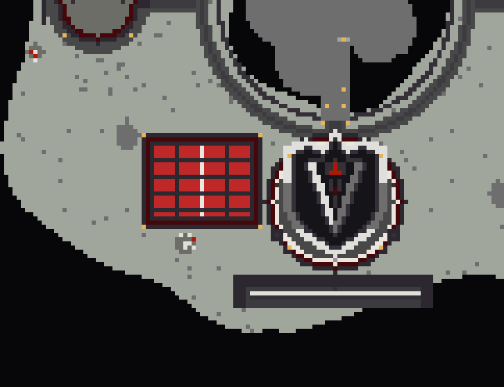

# Mine d'obsidienne

La mine reste celle déjà validée, sans changement :

- un bloc d'obsidienne de 21 × 15 × 8 au centre exact de l'enceinte ;
- un couloir vide d'un bloc tout autour, du sol à la voûte ;
- un mur fermé, sans sortie, coiffé d'une voûte en ogive en verre rubis sur nervures de pierre noire : on ne peut pas sortir par le haut ;
- l'arrivée se fait sur une plateforme 5 × 5 suspendue au centre, au-dessus de l'obsidienne, avec 3 blocs de chute ;
- le blason VÆLORIA est dans les deux pignons.

## Dans le spawn, sous une verrière

`grotte.py` pose la mine dans le spawn, à l'ouest de la place d'arrivée. Pour cette version, la voûte est remplacée par un **plafond plat en verre rubis, au niveau du sol** :

- **Depuis le spawn :** on marche sur la verrière et on voit la mine en dessous, avec les joueurs qui minent. Elle touche presque la place, dont le bord ouest est à un bloc, et elle est à une vingtaine de blocs du point d'apparition.
- **Depuis la mine :** on voit le ciel et le spawn à travers le verre.

Le reste de la mine ne change pas : obsidienne 21 × 15 × 8, couloir d'un bloc vide sur toute la hauteur, mur sans sortie, plateforme d'arrivée suspendue au centre avec 3 blocs de chute. La verrière repose sur une grille de pierre noire, avec un faîtage en quartz dans l'axe. Des lanternes pendent sous les nervures. Comme il n'y a plus de pignons, le blason VÆLORIA est posé sur les murs nord et sud. Autour de la verrière, au sol, on trouve un anneau rubis, un anneau de pierre noire et un lampadaire à chaque angle, dans le style de la place d'arrivée.

Sous terre, les murs sont pris dans une grotte creusée dans la roche de l'île. Elle est fermée, éclairée par des shroomlights, avec un sol en tuff et les veines rubis et argent de l'île. Là où l'île est trop mince, une bosse de roche est ajoutée par-dessous.

| | Repère du spawn (centre de l'arbre, niveau de marche) |
|---|---|
| Centre de l'obsidienne | x = -32, z = 43 |
| Verrière et haut des murs | y = 0, x -44 → -20, z 34 → 52 |
| Bordure au sol | x -46 → -18, z 32 → 54 |
| Sol de l'enceinte | y = -17 |
| Arrivée (pieds du joueur) | **x = -32, y = -5, z = 43** |



Coupes : `apercu-grotte-coupe-nord-sud.png` (x = -32) et `apercu-grotte-coupe-est-ouest.png` (z = 43).

### Pose sur le serveur

La pose se fait en deux modules. Les deux ont le même point de collage que les autres modules du spawn : le **centre de l'arbre, au niveau de marche**. Il ne faut pas tourner le presse-papiers ni utiliser `-a`, car l'air des modules sert à creuser.

1. Copier les deux `.schem` dans `plugins/WorldEdit/schematics/` (ou `plugins/FastAsyncWorldEdit/schematics/`).
2. Se placer au centre de l'arbre, puis :
   ```
   //schem load vaeloria-mine-obsidienne-grotte
   //paste
   //schem load vaeloria-mine-obsidienne-verriere
   //paste
   ```
   - `grotte` contient tout ce qui est en dessous de y = -2 (jusqu'à y = -3) : la mine, la grotte et la bosse de roche. Il ne touche pas la surface.
   - `verriere` couvre seulement l'emprise de la bordure (x -46 → -18, z 32 → 54), de y -2 à y 5 : la verrière, la bordure et les lampadaires.
3. Se téléporter au point d'arrivée (-32 / -5 / 43 par rapport au centre de l'arbre, sur la pierre de magnétite), puis :
   ```
   /setwarp mine-obsidienne
   ```
4. **Indispensable :** protéger la verrière, les murs et la plateforme avec WorldGuard. Sinon un joueur pourrait casser le verre pour sortir de la mine par le haut, ou pour y entrer depuis le spawn. Seule l'obsidienne doit rester cassable, et sa régénération est confiée à un plugin de mine.

Les retouches faites à la main dans l'emprise de la bordure, ou dans la roche sous x -49 → -15, z 28 → 58, seront écrasées par le gabarit.

### Seule, avec sa voûte

`vaeloria-mine-obsidienne.schem` contient la mine seule. Son point de collage est le point d'arrivée : `//paste` à l'endroit du warp, puis `/setwarp`.

## Régénérer

```sh
python3 minecraft/mine-obsidienne/generate.py   # mine seule, avec sa voûte
python3 minecraft/mine-obsidienne/grotte.py     # mine du spawn sous verrière (vérifie aussi : grotte fermée et éclairée, surface touchée seulement sous la bordure)
```

Les deux scripts réutilisent `minecraft/spawn/generate.py`, ce qui garantit le même format (Sponge v2, Minecraft 1.21.4) et la même île.
