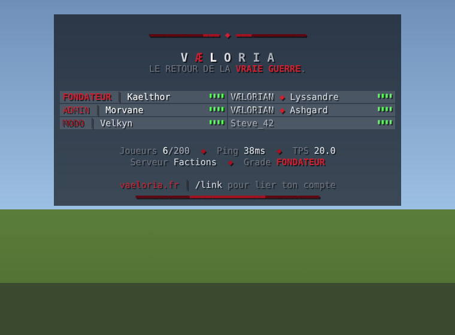
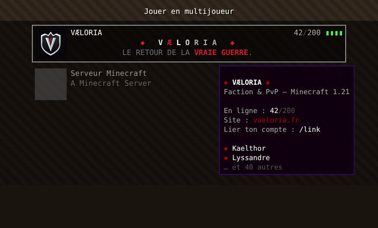

# VaeloriaTab

TAB, chat, annonces de connexion et écran Multijoueur aux couleurs du logo VÆLORIA, pour Paper 1.21.4+ (Java 21). Aucune dépendance externe.



## TAB

- **En-tête** : wordmark `V Æ L O R I A` argent balayé par un reflet blanc animé, l'**Æ en rubis** comme sur le logo, filets rubis et devise « LE RETOUR DE LA **VRAIE GUERRE**. »
- **Pied de page** : joueurs visibles / max, ping et TPS colorés selon des seuils, serveur, grade du joueur, `vaeloria.fr` et `/link`.
- **Noms** : préfixe de grade (Fondateur, Admin, Modo, VÆLORIAN…) et **tri** de la liste par grade.
- Charte du logo (`brand/build.py`) disponible comme balises MiniMessage : `<ruby>`, `<ruby_hi>`, `<ruby_lo>`, `<snow>`, `<silver>`, `<steel>`, `<ash>`, `<graphite>`.

## Chat et connexions

- **Chat** : chaque message est précédé du nom au format du grade, le même que dans le TAB (`FONDATEUR │ Pseudo » message`). Survol du nom : grade et serveur ; clic : `/msg Pseudo`. Un grade peut avoir son propre format (`ranks.<grade>.chat`, ex. message blanc pour le staff). Le texte tapé par les joueurs n'interprète aucune balise.
- **Connexion / déconnexion** : `[+] Pseudo` / `[-] Pseudo` avec le grade, annonce dédiée par grade possible (`ranks.<grade>.join` / `quit`, ex. « ⚔ Le Fondateur … entre dans la bataille. »), annonce de **toute première connexion** avec le numéro du joueur, et message privé de bienvenue avec liens cliquables vers vaeloria.fr et `/link`.
- **Faction** : avec VæloriaFactions, le tag de faction s'affiche devant (`[**Ordre-Noir] FONDATEUR │ Pseudo » message`), coloré pour chaque lecteur selon sa relation (membre, allié, trêve, ennemi). VaeloriaTab formate le message en premier (priorité LOW) et VæloriaFactions l'enveloppe (priorité HIGH) : l'ordre ne dépend pas du chargement des plugins. Le style du tag se règle dans `plugins/VaeloriaFactions/messages.yml` (`chat.public-tag`), son affichage dans `config.yml` (`chat.tags`). Les chats de faction et d'alliance (`/f c`) gardent leur propre format.
- **Discrétion** : aucune annonce pour les joueurs en vanish ni pour la permission `vaeloria.join.silent`.

Avec EssentialsX : mettre `custom-join-message: ""` et `custom-quit-message: ""` dans `plugins/Essentials/config.yml`, vider `motd.txt`, et retirer **EssentialsChat** (ou tout autre plugin de format de chat), sinon les deux formats se superposent.

## Écran Multijoueur



- **Icône** : le bouclier du logo (`brand/server-icon.png`, intégré au jar). Pour la changer : déposer un PNG 64×64 `server-icon.png` dans `plugins/VaeloriaTab/`.
- **MOTD** : ligne 1 avec le wordmark argent et l'Æ rubis entre deux losanges, ligne 2 en rotation (devise, « Faction ◆ PvP 1.8 ◆ Guerres d'empires », boutique). Les deux lignes sont **centrées au pixel** près selon la police Minecraft. Chaque ligne doit tenir sur ~270 px (environ 45 caractères).
- **Bulle du compteur de joueurs** : présentation du serveur, joueurs en ligne, site, `/link`, puis quelques pseudos connectés et « … et N autres ». Le client n'y affiche que les 16 couleurs Minecraft : la config utilise donc `<white>`, `<gray>`, `<dark_gray>`, `<dark_red>`.
- **Texte de version** : `VÆLORIA 1.21+`, montré aux clients d'une version incompatible.
- **Maintenance** (`server-list.maintenance.enabled: true` puis `/vtab reload`) : MOTD dédié, « Maintenance » à la place du compteur, connexions refusées avec un message aux couleurs du logo, sauf permission `vaeloria.maintenance.bypass` (ops par défaut).

Le nom « VÆLORIA » au-dessus du MOTD est celui que chaque joueur saisit dans sa liste : un serveur ne peut pas le choisir.

## Installation

```sh
cd plugins/vaeloria-tab && gradle build   # → build/libs/vaeloria-tab-0.1.0.jar
```

Copier le jar dans `plugins/` du serveur, démarrer, ajuster `plugins/VaeloriaTab/config.yml`, puis `/vtab reload` (permission `vaeloria.tab.admin`, ops par défaut).

## Grades

Chaque grade de `config.yml` a une permission ; le joueur reçoit le grade d'`order` le plus élevé qu'il possède (`default` sinon). Exemple avec LuckPerms :

```
/lp group vaelorian permission set vaeloria.rank.vaelorian
/lp user TonPseudo permission set vaeloria.rank.fondateur
```

Ces permissions sont déclarées à `false` par défaut : un op n'apparaît pas « Fondateur » sans qu'on le lui donne. Les grades sont relus toutes les `names-refresh-ticks` (2 s par défaut), un changement LuckPerms apparaît donc sans reconnexion.

## Variables

`<logo>`, `<player>`, `<rank>`, `<online>`, `<max>`, `<ping>`, `<tps>`, `<server>`, `<world>`, et les couleurs `<ping_color>…</ping_color>`, `<tps_color>…</tps_color>`.
